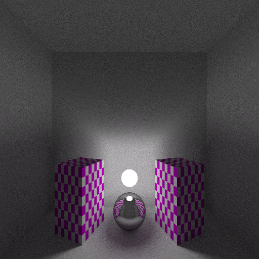

# render_mate
I've started this project to improve my Rust skills. This is a simple Ray-Tracer implementation which supports:
- Computation on 8 threads
- Triangle-Meshes with support for custom geometry extention, e.g. procedural
- Texturing using nearest-filter
- Diffuse and mirror materials

